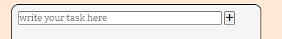
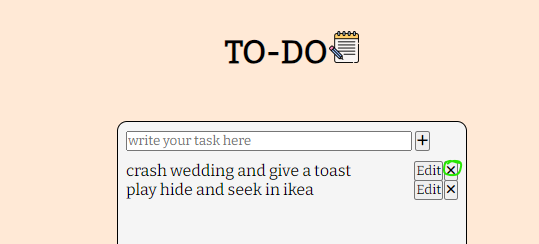
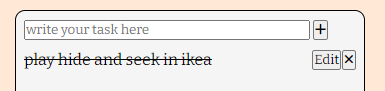
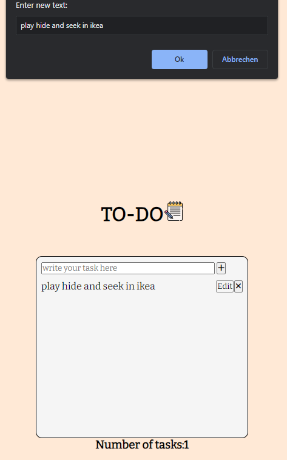
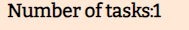
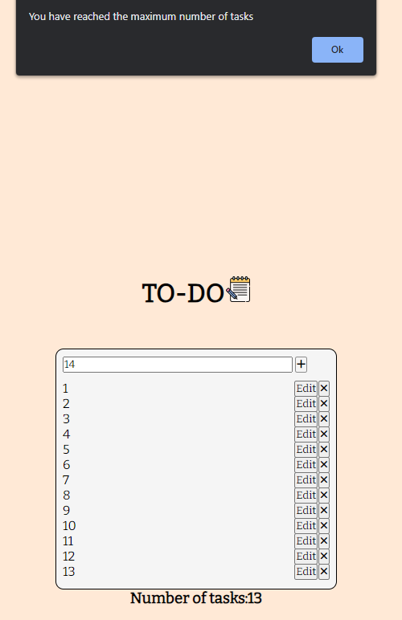

# To- Do Lit Website!

This website allows users to add, delete and mark tasks as completed.
It provides a user-friendly interface for managing tasks and keeping track of which of them are completed.

Website Link: https://karolsu96.github.io/PP2/

GitHub Repo: https://github.com/KarolSU96/PP2

## Table of Contents

[Features](#features)
[Languages](#languages)
[Deployment](#deployment)
[Design](#design)
[Bugs](#bugs)
[Credits](#credits)
[Validators](#validators)
[Improvement](#improvement)

## Features

- ### Crate a task

  

  - As a user, I want to be able to add a new task to my task list. When I enter the task description in the input field, I expect to see the "Add" button, which I can click to add the task to the list. The website allows the user to be intentional with the descriptions. Locking the number of letters to 30.

- ### Delete a task

  

  - As a user, I want to easily remove unwanted tasks from my list. By clicking on the "X" button associated with each task, I expect the desired task to be promptly deleted from the list.

- ### Mark as completed

  

  - As a user, I want to keep track of completed tasks. When I click on a task in the list, I expect it to be visually crossed out, indicating that it has been marked as completed.

- ### Edit a task

  

  - As a user, I want to be able to modify tasks. When I click on the "Edit" button associated with a task, I expect to be able to edit this task. The popup box allows me to edit the desired task and save it.

- ### Display the total number of tasks

  

  - As a user, I want to know the total number of tasks on my list. I expect the number of tasks to be displayed prominently on the page. The counter should be automatically updated whenever I add or remove tasks.

- ### Lock the number of tasks to 13
  
  - As a user, I want to be sure that my task list remains manageable and doesn't become overwhelming. I also expect the tasks to not shoot through the designed list. If I attempt to add the 14th task, I should receive a clear indication that the maximum limit has been reached.

## Languages:

- HTML
- CSS
- JavaScript

## Deployment:

This website is deployed using GitHub Pages.
The Editor that I've been using is VS Code with extensions:

- Auto Close Tag
- Color Highlight
- ESLint
- file-icons
- GitHub Codespaces
- Live Preview
- Live Server
- One Dark Pro
- Prettier - Code formatter
- stylelint-plus
- Toggle Column Selection

I would like to thank Code Institute for a short tutorial for the deployment of the websites on GitHub.

Let me take you through the process of deployment of this website:

1. Go to project's directory on Github.
2. Click on "Settings".
3. Scroll to the "GitHub Pages".
4. Select Main as "Source".
5. Click save.
6. The site link will be generated after a few minutes.

## Design

The website has a simple design that helps its users focus on their tasks. It uses the "Bitter" font imported from Google Fonts to provide good readability on screens and an elegant style.
The background color of the body is a soft peach which creates a warm and inviting atmosphere for the user.
The header includes the title and an image from Flaticon in high resolution which looks aesthetically pleasing. The main section is styled with rounded corners and a delicate background for clean look.
The footer is fixed to the bottom of the page and contains a link to my Github Page and takes the users to the Credit section.
Icons from Font Awesome are utilized to enhance the visual appear.

## Bugs:

Throughout the development process, I struggled with the delete function. Somehow my approach wasn't working or was not consistent. I figured out that there must be something going on with the icon, after carefully examining the page with Pesticide Chrome extension. I managed to find a thread on stack https://stackoverflow.com/questions/60692659/icon-makes-the-button-not-clickable and changed the pointer-events property to none.

## Credits:

- Notes Icon - Flaticon https://www.flaticon.com/free-icon/pencil_3075908?term=note&page=1&position=5&origin=tag&related_id=3075908
- Github Icon - Fontawesome https://fontawesome.com/
- Code Institute Tutors Team, which helped me get through bugs. It really wouldn't be possible for me to make this project without them.
- Tyler Potts Tutorial which helped me with prompting the user for the input and idea for a project https://www.youtube.com/watch?v=MkESyVB4oUw&t=1362s

## Validators:

- W3C validator shows no errors or warnings.
- Jigsaw validator shows no errors or warnings.
- Jshint is all good. It shows 15 warnings which are caused by me using let variable. It's not a problem as I use ES6.

## Improvement:

- There is still room for improvement. In the future, I would like to add a user profiles, which would save the tasks even after refreshing the page. User could then log in with her/his login and save their notes.
